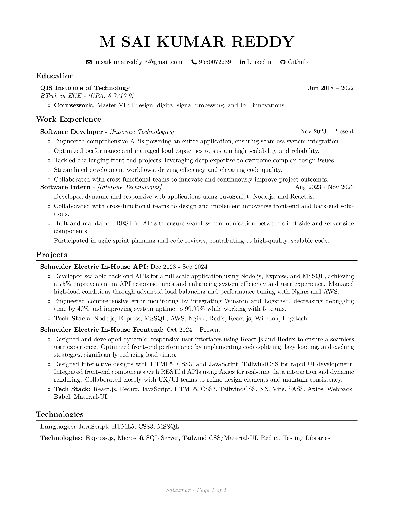

  
  
    

  

<h1 align="center">🌐 Full Stack Web Developer | JavaScript, NodeJS & ReactJS</h1>

  
  
  

  
📄 **Click to View & Download My Resume** 👨‍💼

  
  
  [🔽 **Download My Resume** 🔽](https://drive.google.com/file/d/18E50f7m9RtlmLTNSEUbPdME0TWG8y5zW/view?usp=sharing)

---

## 👨‍💻 About Me

🎓 ECE Graduate from **QIS Institute of Technology**  
💡 Passionate about solving real-world problems through both frontend and backend development  
🛠️ Currently focused on: `ReactJs`, `TailwindCSS`, and `RestAPI's`  
📌 Always learning & building cool stuff on the web  

---

## 🧰 Tech Stack

| Languages | Web Dev | Databases | Tools |
|----------|---------|-----------|-------|
|  |  |  |  |
|  |  |  |  |

## 📈 GitHub Stats

  
   
  

---

## 📫 Connect With Me

  
  
  

---

  ⭐ *Let's build something awesome together!* ⭐

